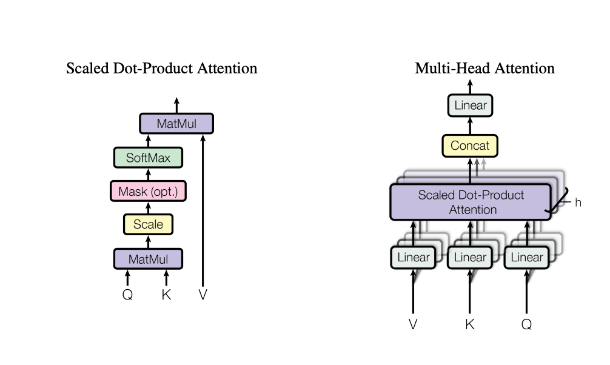
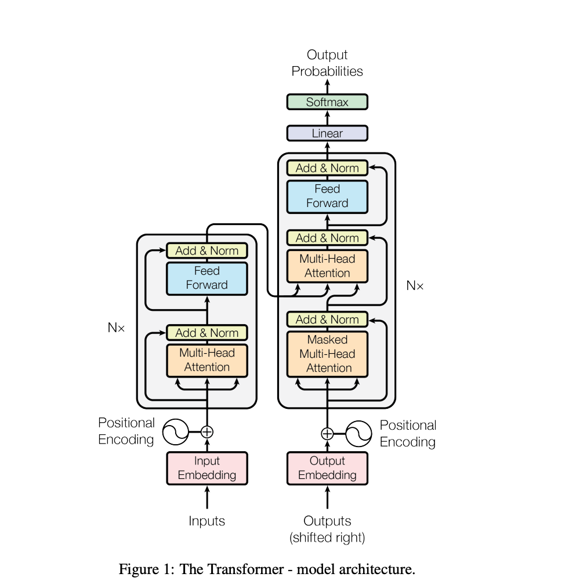

# Attention Is All You Need - End-to-End Explanation

*A companion to Phase 1: Vector Geometry - this paper is where your vector intuition (dot products, linear combinations) gets used directly.*

---

## The Problem: Why We Needed Attention

### Before 2017: Sequential Processing (Slow & Forgetful)

Before the Transformer paper, language models were **RNNs (Recurrent Neural Networks)** that read sentences word-by-word, left to right:

```
Word 1 → Word 2 → Word 3 → Word 4 → Word 5
```

**Problems:**
1. **Slow** - words must be processed one at a time (can't parallelize)
2. **Forgetting** - by the time the model reaches word 5, it's lost some info about word 1
3. **No long-range vision** - word 1 and word 5 never directly "see" each other

### The Big Idea: Attention (2017)

Instead: **let every word look at every other word simultaneously**, and decide which ones matter most.

```
        Word 1
         ↙  ↓  ↘
Word 2 ←→ Word 3 ←→ Word 4
         ↗  ↑  ↖
        Word 5
```

Every word attends to the entire context at once. Fast, parallel, and with perfect memory.

---

## Understanding Attention with a Real Example

### Ambiguity: Pronoun Resolution

> "The animal didn't cross the street because **it** was too tired."

What does "it" refer to? The animal? The street? 

You instantly know: **the animal** - because you pay *attention* to which word is most relevant when interpreting "it."

### How Attention Works

A Transformer solves this by having each word ask: **"Which words in this sentence should I focus on?"**

For the word "it":
- It looks at "animal" and thinks: *"This is relevant - it's a living thing that gets tired"*
- It looks at "street" and thinks: *"Less relevant - streets don't get tired"*
- It combines information from these words, **weighted by relevance**

Result: "it" correctly understands it refers to the animal.

---

## The Math: Attention Using Vectors

You already know vectors and dot products from Phase 1. Attention is exactly those concepts applied to language.

### From Phase 1: Dot Product as Similarity

$$\text{similarity} = \vec{a} \cdot \vec{b} = a_1 b_1 + a_2 b_2 + \cdots + a_n b_n$$

- Aligned vectors → high dot product
- Perpendicular vectors → dot product near 0
- Opposite vectors → negative dot product

### The Three Vectors: Query, Key, Value

Each word's vector is transformed into **three versions**:


*Figure 2: Scaled Dot-Product Attention (left) and Multi-Head Attention (right) from the original paper*

| Vector | Role | Question It Asks |
|--------|------|------------------|
| **Query (Q)** | "What am I looking for?" | What information do I need? |
| **Key (K)** | "What do I contain?" | What information do I have? |
| **Value (V)** | "My information" | If picked, what do I give? |

### The Attention Calculation (Step-by-Step)

For word A paying attention to word B:

**Step 1: Compute Similarity**
$$\text{score}_{A \to B} = Q_A \cdot K_B$$

(Dot product of A's Query and B's Key)

**Step 2: Convert Scores to Percentages**

For word A attending to all words:
$$\text{weight}_i = \text{softmax}(\text{scores}) = \frac{e^{\text{score}_i}}{\sum_j e^{\text{score}_j}}$$

(Softmax turns raw scores into probabilities that sum to 1)

**Step 3: Compute Attention Output**

$$\text{attention}_A = \sum_i \text{weight}_i \cdot V_i$$

(Weighted sum of all Value vectors - a **linear combination**)

### Visual Example

```
Word: "it"

Query: "it" = [0.2, -0.5, 0.8, ...]

Keys available:
  "animal" = [0.1, -0.6, 0.7, ...]
  "street" = [0.9, 0.1, -0.2, ...]
  "didn't" = [0.3, 0.2, -0.1, ...]

Dot products (similarity scores):
  "it" · "animal" = 0.2(0.1) + (-0.5)(-0.6) + 0.8(0.7) = 0.74 ← HIGH
  "it" · "street" = 0.2(0.9) + (-0.5)(0.1) + 0.8(-0.2) = 0.08 ← LOW
  "it" · "didn't" = 0.2(0.3) + (-0.5)(0.2) + 0.8(-0.1) = -0.06 ← LOWEST

After softmax:
  "animal":  74% ← "it" focuses heavily on this
  "street":  20%
  "didn't":   6%

Final output:
  0.74 × Value("animal") + 0.20 × Value("street") + 0.06 × Value("didn't")
                ↑ heavy weight                ↑ light weight
```

**Result:** The word "it" has now incorporated the semantic meaning of "animal" as its primary context.

---

## Multi-Head Attention: Multiple Perspectives

The model doesn't do attention just **once** - it does it **8, 12, or 16 times in parallel** ("heads"), each focusing on different patterns:

```
Input Vector
    ↓
┌─────────────────────────────────────────┐
│ Head 1: Grammar  → "Who's the subject?" │
│ Head 2: Adjectives → "What describes what?" │
│ Head 3: References → "Who does 'it' mean?" │
│ Head 4: Tense → "When did this happen?" │
│    ...
└─────────────────────────────────────────┘
    ↓
Concatenate all heads
    ↓
Output: Rich, multi-faceted understanding
```

Each head learns to focus on different linguistic relationships. Combined, they give the model a complete picture.

---

## Positional Encoding: Adding "Where" Information

### The Problem

If all words attend to all other words simultaneously, the model loses the natural sequence: *first word, second word, third...*

Example: both of these have the same words but different meanings:
- "dog bites man"
- "man bites dog"

### The Solution: Positional Encoding

Add a **position vector** (based on sine/cosine waves) to each word's embedding:

```
Position 1: [1.0, 0.0, 1.0, 0.0, ...]
Position 2: [0.84, 0.84, 0.0, 1.0, ...]
Position 3: [0.0, 1.0, -1.0, 0.0, ...]
...
```

Now the model knows both:
- **What** the word is (semantic embedding)
- **Where** it is in the sentence (position encoding)

---

## The Complete Transformer Architecture

### Original Paper Architecture


*Figure 1: The Transformer model architecture from the original "Attention Is All You Need" paper (Vaswani et al., 2017)*

**Understanding the diagram:**
- **Left side (Encoder)**: Reads the input sentence and builds a rich context representation
- **Right side (Decoder)**: Generates the output sentence one word at a time, attending back to the encoder
- **N×**: Both stacks repeat 6 times (6 identical encoder layers, 6 identical decoder layers)
- **Multi-Head Attention** (orange/tan boxes): Where all the attention happens - words attend to each other
- **Feed Forward** (blue boxes): Additional neural network processing per word
- **Add & Norm** (yellow boxes): Residual connections (prevents information loss) + layer normalization (keeps values stable)
- **Positional Encoding** (wavy symbols): Adds position information to each word vector

### Detailed Step-by-Step Breakdown

Here's the same architecture as an ASCII flowchart for clarity:

```
INPUT SENTENCE
     ↓
[Tokenization & Embedding]
     ↓
[Add Positional Encoding]
     ↓
┌──────────────────────────┐
│   ENCODER STACK          │
│  (6 identical layers)    │
│                          │
│  ┌─────────────────────┐ │
│  │ Multi-head Attention│ │
│  └──────────┬──────────┘ │
│             ↓            │
│  ┌─────────────────────┐ │
│  │ Feed-forward Net    │ │
│  └─────────────────────┘ │
│  (repeat 6×)            │
└────────┬─────────────────┘
         ↓
   [Encoder Output]
   (rich context representation)
         ↓
┌──────────────────────────────┐
│   DECODER STACK              │
│  (6 identical layers)        │
│                              │
│  ┌──────────────────────────┐│
│  │ Masked Self-Attention    ││
│  │ (can only see past words)││
│  └────────────┬─────────────┘│
│               ↓              │
│  ┌──────────────────────────┐│
│  │ Cross-Attention          ││
│  │ (attends to encoder)     ││
│  └────────────┬─────────────┘│
│               ↓              │
│  ┌──────────────────────────┐│
│  │ Feed-forward Net         ││
│  └──────────────────────────┘│
│  (repeat 6×)                │
└─────────────────┬────────────┘
                  ↓
          [Linear Layer]
                  ↓
          [Softmax]
                  ↓
          [Next Word]
                  ↓
            [Feed Back]
                  ↓
              (Repeat)
```

---

## The Complete Forward Pass (Step-by-Step)

### Step 1: Tokenization
Input: `"The animal didn't cross the street"`

Output: Token IDs
```
[1, 45, 78, 234, ...]
↑   ↑   ↑    ↑
The animal didn't cross ...
```

### Step 2: Embedding
Each token ID → vector of 512 numbers (learned during training)

```
Token ID 1 → [0.2, -0.5, 0.8, 0.1, ..., -0.3]  (512 numbers)
             This is word 1's "meaning fingerprint"
```

### Step 3: Positional Encoding
Add position information to each embedding

```
Embedding of word 1:  [0.2, -0.5, 0.8, 0.1, ..., -0.3]
+
Position encoding 1:  [1.0, 0.0, 1.0, 0.0, ..., 0.2]
=
Word 1 input:         [1.2, -0.5, 1.8, 0.1, ..., -0.1]
```

### Step 4: Encoder Stack (6 Layers)

Each layer does:

**a) Multi-Head Self-Attention**
- Every word attends to every other word in the input
- 8 heads running in parallel

**b) Residual Connection & Layer Norm**
```
output = LayerNorm(input + MultiHeadAttention(input))
```
(Add input back to prevent information loss)

**c) Feed-Forward Network**
```
output = LayerNorm(input + FFN(input))
```
(Small neural network applied to each word's vector)

**d) Repeat 6 times**

After 6 layers: Each input word now has a **contextualized vector** that incorporates meaning from the entire input.

### Step 5: Decoder Stack (6 Layers)

For generating output, each layer does:

**a) Masked Self-Attention**
- The decoder only attends to words it has **already generated**
- Can't peek at future words (it's generating them!)

```
Generated so far: "La"
Can attend to: "La"
Cannot attend to: (nothing, haven't generated yet)
```

**b) Cross-Attention (Encoder-Decoder Attention)**
- The decoder attends to the **encoder's output**
- Allows decoder to "look back" at the input when deciding what to generate next

```
Decoder asking: "What was said in the input?"
Looking at: Encoder's contextualized vectors
```

**c) Feed-Forward Network**
- Same as encoder

**d) Repeat 6 times**

### Step 6: Linear & Softmax

```
Decoder output vector (512 numbers)
         ↓
  [Linear layer]
  Projects to vocabulary size (e.g., 50,000)
         ↓
  [50,000 scores, one per possible word]
         ↓
  [Softmax]
  Converts to probabilities summing to 1
         ↓
  argmax → Select highest probability word
         ↓
  Output word (e.g., "perro" for Spanish)
```

### Step 7: Autoregressive Loop

The newly generated word feeds back as input:

```
Step 1: Input = [the, animal] → Output = "gato"
Step 2: Input = [the, animal, gato] → Output = "didn't"
Step 3: Input = [the, animal, gato, didn't] → Output = "cross"
...
Until: [EOS] (end-of-sentence token)
```

---

## How It Learns (Training)

The model doesn't start knowing anything. Training teaches it.

### The Process

1. **Show the model a sentence** and the correct translation/answer
2. **Make a prediction** for each word position
3. **Compare prediction to truth** using cross-entropy loss
   ```
   Loss = -log(probability of correct word)
   Higher probability → lower loss → better
   ```
4. **Backpropagate the error** through all 6 encoder layers, all 6 decoder layers, and all millions of parameters
5. **Adjust weights** to reduce loss (via gradient descent)
6. **Repeat** over millions of sentences

Result: The model learns what to attend to and how to represent meaning.

---

## The Complete Pipeline: Visual Summary

```
Input: "The animal didn't cross the street"
  ↓
[1. Tokenize] → [The][animal][didn't][cross][the][street]
  ↓
[2. Embed] → Vector for each token
  ↓
[3. Add Position] → Vectors now include position info
  ↓
[4. Encoder Stack ×6]
  ├─ Self-Attention (every word ↔ every word)
  └─ Feed-forward
  ↓
[5. Decoder Stack ×6]  ← Generates one word at a time
  ├─ Masked Self-Attention (only past words)
  ├─ Cross-Attention (to encoder)
  └─ Feed-forward
  ↓
[6. Linear + Softmax] → Probability for each word
  ↓
Output: "gato" (Spanish) / "cat" (English) / etc.
  ↓
[Feed back to decoder]
  ↓
Repeat until [EOS]
```

---

## Why Transformers Changed Everything

### 1. **Parallelization**
- Old RNNs: word 1 → word 2 → word 3 (sequential, slow)
- Transformers: all words processed **at once** (parallel, GPU-friendly, **100x faster**)

### 2. **Long-Range Memory**
- Old RNNs: word 5 forgets about word 1 as info passes through the network
- Transformers: word 5 directly attends to word 1 (perfect memory)

### 3. **Interpretability**
- Attention weights show **what the model is focusing on**
- You can visualize which words matter for each prediction

### 4. **Scalability**
- The same architecture scales from 1M parameters to 175B (GPT-3) to 1T+ parameters
- Same principles, just bigger

### 5. **Foundation for Modern AI**
- GPT (OpenAI) - Transformer decoder only
- BERT (Google) - Transformer encoder only
- T5 (Google) - Full Transformer
- LLaMA, Claude, Gemini - All Transformers

---

## Connection Back to Phase 1: Vector Geometry

This is where everything comes together.

### Vectors
```
Phase 1: Abstract vectors in n-dimensional space
Transformer: Vectors represent meaning of words (512 dimensions)
```

### Dot Product
```
Phase 1: a · b = similarity of direction
Transformer: Q · K = attention score (which words matter?)
```

### Linear Combinations
```
Phase 1: c = α₁v₁ + α₂v₂ + ... (weighted sum of vectors)
Transformer: output = w₁V₁ + w₂V₂ + ... (context = weighted sum of values)
```

### Matrix Multiplication
```
Phase 1: Transform a vector: y = Mx (multiply by matrix)
Transformer: Query = XW^Q (convert embedding to query space via matrix)
```

### Basis & Span
```
Phase 1: Vectors span a space; basis = minimum spanning set
Transformer: Embeddings span a "meaning space"; attention operations stay in this space
```

**Every single operation in the Transformer rests on concepts from Phase 1 - just applied at massive scale with weights learned from billions of words.**

---

## Quick Reference: What Happens Where

| Component | Input | Process | Output | Why |
|-----------|-------|---------|--------|-----|
| Embedding | Token ID | Lookup in learned table | 512-dim vector | Converts words to math |
| Position | Position number | Sine/cosine formula | 512-dim vector | Tells model word order |
| Self-Attention | Word vectors | Query·Key → Softmax → weighted values | Updated vectors | Words understand each other |
| Cross-Attention | Encoder & decoder vectors | Decoder queries encoder | Decoder learns input context | Decoder looks back at input |
| Feed-Forward | Word vectors | Two dense layers + ReLU | Updated vectors | Adds expressiveness |
| Linear + Softmax | Final vector | Project to vocab, convert to probability | 50K probabilities | Pick next word |

---

## Common Questions

**Q: Why 512 dimensions for embeddings?**
A: Arbitrary choice (could be 256, 768, 1024). Bigger = more expressiveness but slower & more parameters.

**Q: Why 6 encoder and 6 decoder layers?**
A: Empirically found to work well. Original paper used 6; modern models use 12-96 layers.

**Q: Can I visualize attention?**
A: Yes! See [Attention is All You Need visualization](https://jalammar.github.io/attention-is-all-you-need/) - shows which words each word attends to.

**Q: What's the difference between this and my brain?**
A: No one knows exactly how attention works in brains. Transformers' attention is mathematically elegant but likely oversimplifies biological cognition.

---

## The Original Paper

**Title:** "Attention Is All You Need"  
**Authors:** Vaswani et al. (Google Brain, 2017)  
**Links:**
- Google AI Blog announcement: https://ai.googleblog.com/2017/08/transformer-novel-neural-network.html
- Jay Alammar's excellent visual explanation: http://jalammar.github.io/attention-is-all-you-need/
- arXiv: Search "Attention Is All You Need Vaswani"

**Key contribution:** Showed that attention mechanisms alone (no recurrence, no convolutions) are sufficient to achieve state-of-the-art performance.

This single paper laid the foundation for every major language model built after 2017. The blog posts above are often easier to understand than the paper itself, and include interactive visualizations.

---

## Next Steps

1. **Run the math yourself:** Take a simple sentence, compute dot products, softmax, weighted sums by hand
2. **Visualize attention:** Use tools to see which words models pay attention to
3. **Implement a mini Transformer:** Write attention from scratch in PyTorch (20 lines of code!)
4. **Read the paper:** The original is more readable than you think - starts with figures, math builds naturally
